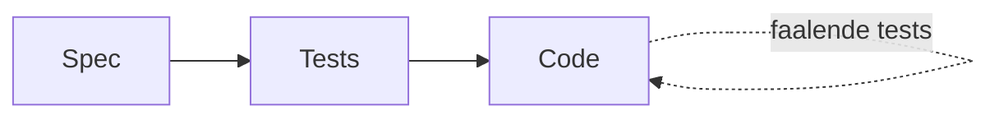

# Praktijkles 2 — Specification Driven Development met MCP (2u)

## Overzicht

In deze les bouw je een **Student Grade Analyzer**: een command line tool die een CSV met studentresultaten analyseert. Je doet dat in deze strikte volgorde:

1. **Specification Driven Development**: eerst de spec, dan de tests, dan pas de code
2. **Test-Driven Development (TDD)** als denkmodel
3. **Model Context Protocol (MCP)**: off-the-shelf servers die je agent extra mogelijkheden geven

De kernboodschap van deze les: **de grootste fout zit niet in de code maar in de specificatie.**

## Leerdoelen

Na deze les kan de student:

- een PRD/spec schrijven vóór er code bestaat
- requirements omzetten naar tests
- Test Driven Development toepassen met een agent
- een MCP-server gebruiken
- tools bewust inzetten in plaats van enkel prompts te schrijven

---

## De opdracht: Student Grade Analyzer

Bouw een command line tool die een CSV met studentresultaten analyseert.

Voorbeeld `data/makkelijk/results_v3.csv`:

```csv
name,score
Alice,14
Bob,8
Charlie,17
```

Gebruik:

```shell
python grade_analyzer.py results.csv
```

Verwachte output:

```text
Aantal studenten: 3
Gemiddelde score: 13.0

Geslaagd:
- Alice
- Charlie

Niet geslaagd:
- Bob
```

Regel: **geslaagd = score >= 10**. Denk na over welke andere regels je nodig zult hebben terwijl je dit project maakt.

---

## Denkkader

### TDD als denkmodel (geen testtechniek)

TDD draait om drie stappen: **Rood → Groen → Refactor**.

- **Rood**: je dwingt jezelf na te denken over *wat* de code moet doen, vóórdat je schrijft *hoe*
- **Groen**: je schrijft de eenvoudigst mogelijke oplossing, geen over-engineering
- **Refactor**: je verbetert de code terwijl het blijft werken

> "TDD is niet hoe je testen schrijft. Het is hoe je code ontwerpt die getest kan worden."

### Waarom TDD met een AI-agent?

Een AI-agent (zoals Cline) heeft **heldere, verifieerbare doelen** nodig. Specs en tests zijn perfect daarvoor.

### MCP in 5 minuten

**MCP** (Model Context Protocol) is een open standaard voor het verbinden van AI-applicaties met externe systemen.

💡 **Analogie**: MCP is **USB-C voor AI**. USB-C standaardiseert hoe apparaten verbinden; MCP standaardiseert hoe AI-agenten verbinden met data, tools en systemen.

Architectuur: **host** (VS Code met Cline) → **client** (één verbinding per server) → **server** (een programma dat tools, resources en prompts aanbiedt).

| Primitive | Wie controleert? | Wat doet het? | Voorbeeld |
|---|---|---|---|
| **Tools** | Model-gestuurd | Voer acties uit, roep APIs aan | `list_directory()`, `run_query()` |
| **Resources** | App-gestuurd | Deel data als context | Bestanden, database-schema's |
| **Prompts** | Gebruiker-gestuurd | Gestructureerde instructies | Code-review prompt |

Tool discovery: de agent vraagt `tools/list` en **beslist zelf** welke tool hij aanroept via `tools/call`. Het model kiest, jij reviewt.

In deze les bouwen we **geen eigen MCP-server**. We installeren **off-the-shelf servers**: kant-en-klare MCP-servers die iemand anders al bouwde en onderhoudt. Dat is precies de meerwaarde van MCP: één keer bouwen, overal gebruiken.

---

## Deel 0 - clinerules en structuur
Maak een .clinerules file, met de principes van Karpathy zoals we vorige week hebben gebruikt. Bekijk ook al de gewneste folderstructuur:
### Structuur

Aan het begin van de les is dit de blanco startstructuur. Studenten vullen ze zelf in tijdens de delen:

```
praktijkles2/
├── .clinerules                 ← agentregels, o.a. spec-first + "maak geen aannames"
├── instructions.md             ← dit bestand
├── mcp_config.md               ← MCP-configuratie-handleiding
├── .vscode/
│   └── cline_mcp_settings.json ← off-the-shelf MCP-servers voor deze les
├── docs/
│   └── ADR/                    ← architecture decision records (optioneel bij de SQLite-migratie)
├── specs/
│   └── specification.md        ← ontstaat in Deel 1
├── harness/
│   └── run_tests.sh            ← lint + type check + tests in één commando
├── data/
│   ├── results.csv             ← startdata
│   ├── students.csv            ← uitbreiding: klassen
│   └── grades.db               ← ontstaat in Deel 4 (SQLite)
├── prompts/
│   ├── fase1_spec.md
│   ├── fase2_tests.md
│   ├── fase3_implementatie.md
│   ├── fase4_mcp.md
│   ├── fase5_onduidelijke_spec.md
│   └── uitbreiding_per_klas.md
├── src/
│   └── grade_analyzer.py       ← ontstaat in Deel 3
└── tests/
    └── test_grade_analyzer.py  ← ontstaan in Deel 2
```

---

## Deel 1 — Eerst de specificatie

**Verboden in dit deel:**

- onmiddellijk code genereren
- onmiddellijk testen schrijven

De agent mag alleen denken en schrijven over **wat** het moet doen, niet **hoe**.

**Prompt aan de agent:** schrijf een prompt die specs aanmaakt voor de applicatie. Let op onderstaande items:

**Resultaat:** `specs/specification.md`
Loop de spec na met deze checklist:

- [ ] Is elke functionele requirement **toetsbaar** (kan je er een test bij schrijven)?
- [ ] Staan er edge cases (lege CSV, score 0, score 100, verkeerd formaat)?
- [ ] Zijn de acceptatiecriteria expliciet en genummerd?
- [ ] Zijn termen gedefinieerd (wat is "gemiddelde", wat betekent "geslaagd")?
- [ ] Staat er wat de agent **niet** mag doen (geen extra features)?

Iets wat je niet kan testen, hoort niet in de spec. Verbeter de spec vóór je naar Deel 2 gaat.

---

## Deel 2 — Acceptatiecriteria omzetten naar tests

**Prompt aan de agent:** schrijf een prompt om de acceptatiecriteria om te zetten en probeer te vermijden dat de agent off topic gaat.

**Resultaat:** een `tests/`-map met pytest-tests, **maar nog geen code**.

Voer de harness uit: `bash harness/run_tests.sh`. Alle tests falen: dit is **rood**, en dat is precies goed.

**Onderlingende principes**

1. **Waarom is dit TDD?** De tests kwamen vóór de code. Ze beschrijven *wat* het moet doen, niet *hoe*. De tests zijn nu de meetlat waaraan elke implementatie wordt opgehangen.
2. **Waarom zijn specs belangrijk?** Zonder spec schrijft de agent tests die passen bij wat hij toevallig wilde bouwen. De spec komt eerst, dus de tests bewaken de bedoeling van de opdrachtgever, niet de uitkomst van de agent.



---

## Deel 3 — Implementatie laten genereren

**Prompt aan de agent:** bewaak opnieuw dat de agent enkel implementeert wat nodig is om de tests te doen slagen.

De agent implementeert en itereert: **test → fix → test → fix**, tot alles groen is. Voer tussendoor de harness uit: `bash harness/run_tests.sh`.

- de agent mag **niets** schrijven dat niet afgedwongen wordt door een test
- "Implementeer exact wat nodig is" voorkomt over-engineering
- de harness is de objectieve jury, niet de agent zelf

Controleer het eindresultaat met de commando's uit de opdracht (output komt exact overeen met de verwachte output?).

---

## Deel 4 — MCP inzetten

Tot nu toe deed de agent alles met zijn ingebouwde tools (bestanden lezen, code schrijven, commando's uitvoeren). Nu koppelen we **off-the-shelf MCP-servers** die extra mogelijkheden toevoegen.

**Wat is een off-the-shelf server?** Een kant-en-klare MCP-server uit de [MCP Servers Registry](https://github.com/modelcontextprotocol/servers). Je bouwt niets zelf; je configureert hem in `.vscode/cline_mcp_settings.json`. De volledige uitleg staat in `mcp_config.md`.

**Kerninzicht:** model ≠ tool. Het LLM is geen filesystem, geen git en geen database. MCP geeft het model **extra mogelijkheden**: tools ontdekken, kiezen en aanroepen. Je bent niet langer enkel prompts aan het schrijven: je stelt de agent tools ter beschikking.

### Stap 0 — Configureren (5 min)

1. Kopieer de configuratie uit `mcp_config.md` naar `.vscode/cline_mcp_settings.json` (staat er al klaar)
2. Herstart VS Code (Ctrl+Shift+P → "Developer: Reload Window")
3. Open Cline en klik op het MCP-knopje: je ziet de servers met status **Connected**

### 4.1 — Filesystem MCP (10 min)

De Filesystem-server geeft de agent een expliciete, begrensde kijk op de werkmap. Laat de agent:

- alle bestanden zoeken
- extra testdata aanmaken

De agent gebruikt nu expliciete filesystem-tools (`list_directory`, `read_file`, `write_file`) in plaats van zijn eigen verborgen aanpak. Elk gebruik is zichtbaar en reviewbaar.

### 4.2 — Git MCP (5 min)

Laat de agent via de Git-server:

- een commit aanmaken
- tonen wat de wijzigingen zijn tov de vorige commit


De agent doet versiebeheer via gestructureerde git-tools (`git_status`, `git_diff`, `git_commit`), niet via ruwe shell-commando's. De diff-geschiedenis wordt de bron van waarheid voor de agent.

### 4.3 — SQLite MCP

Breid de opdracht uit: **resultaten niet langer uit CSV lezen, maar uit `data/grades.db`**.

Eerst laat je de agent de database aanmaken en vullen vanuit `results.csv` (tabel `grades` met kolommen `name` en `score`), daarna leest hij via de SQLite MCP-server. De agent moet via MCP een query uitvoeren:

```sql
SELECT * FROM grades
WHERE score >= 10;
```

**Prompt dit aan de agent:** verwijs expliciet naar het gebruik van de aangesloten MCP servers

**Verschil tegenover standaard prompten**

- dezelfde functionaliteit, maar nu over een echte database via MCP-tools
- de agent kan `list_tables` en `read_query` gebruiken in plaats van de db-file zelf te parsen
- je spec en tests veranderen: de data-bron is een requirement, geen detail

> Tip: zet de sqlite-server eerst op `"disabled": false` in de config (hij staat default uit tot `data/grades.db` bestaat).

---

## Deel 5 — Bewust falende specificatie

Geef nu een slechte requirement aan de agent:

```text
Toon statistieken over de studenten.
```

De correcte agent reageert niet met code, maar met de vraag:

```text
Welke statistieken?
```

De regel in `.clinerules` dwingt dit af:

> Maak GEEN aannames bij onduidelijke requirements. Als een requirement meerdere interpretaties heeft: STOP en stel verduidelijkende vragen.

**De student moet de requirement verduidelijken**, bijvoorbeeld:

```text
Toon:
- gemiddelde
- mediaan
- minimum
- maximum
```

Pas daarna mag de agent de spec aanpassen, nieuwe tests schrijven en implementeren.

**Als het fout gaat:** De grootste fout zit vaak niet in de code maar in de specificatie. Een agent die aannames maakt bij een vage requirement, bouwt met weinig moeite precies het verkeerde ding.

**Prompt aan de agent:** idealiter wordt een slechte prompt niet uitgevoerd, maar wordt je dus bevraagd over meer details.

## Uitbreiding

Voeg een tweede CSV toe, `data/students.csv`:

```csv
name,class
Alice,A
Bob,B
Charlie,A
```

Nieuwe requirement:

```text
Bereken statistieken per klas.
```

De agent moet nu:

1. de spec aanpassen
2. de tests aanpassen
3. de implementatie aanpassen

**Zonder bestaande functionaliteit te breken.** De bestaande tests blijven groen: dat is het verschil tussen "niet stuk maken" en "niet aankijken". Wat er nieuw bij komt, wordt aangetoond door nieuwe tests.

**Prompt aan de agent:** voeg de nieuwe requirement en forceer de agent om het spec - test - implement paradigma te volgen.

---

## Eindreflectie

1. Hoeveel tijd besteedde je aan de spec? Was dat meer of minder dan verwacht?
2. Hoeveel bugs werden vermeden door TDD (spec → tests → code)?
3. Welke MCP-tool was het nuttigst, en waarom?
4. Wanneer maakte de agent verkeerde aannames?
5. Welke regel uit `.clinerules` hielp het meest?

---

## Checklist

- [ ] Cline geïnstalleerd en geconfigureerd (zie praktijkles1)
- [ ] `specs/specification.md` gereviewd vóór er code bestaat
- [ ] Tests eerst, code pas daarna (de harness onthult de volgorde)
- [ ] `bash harness/run_tests.sh` geeft exit code 0
- [ ] Ten minste één off-the-shelf MCP-server aangesloten en gebruikt
- [ ] De vage requirement in Deel 5 is vastgelopen op de agent, niet op jou
- [ ] Commit gemaakt via de Git MCP-server

## Problemen?

| Probleem | Oplossing |
|---|---|
| MCP-server status "Disconnected" | Herstart VS Code of herlaad het venster (zie `mcp_config.md`) |
| `npx` of `uvx` niet gevonden | Installeer Node.js (npx) respectievelijk uv (uvx) |
| SQLite-server start niet | `data/grades.db` moet bestaan; zet `"disabled": false` pas als de database er is |
| Agent schrijft meteen code in Deel 1 | Herinner de agent aan `.clinerules` (spec first) en start eventueel een nieuwe sessie |
| Agent maakt aannames in Deel 5 | Check of de regel "maak geen aannames" in `.clinerules` staat |
| Tests groen maar output klopt niet | De tests dekken de requirement niet af: de spec was onvolledig, terug naar Deel 1 |

---

## Bronnen

- 📖 [Model Context Protocol — Officiële documentatie](https://modelcontextprotocol.io/)
- 🧩 [MCP Servers Registry (off-the-shelf servers)](https://github.com/modelcontextprotocol/servers)
- 🔌 [Cline (VS Code extensie)](https://marketplace.visualstudio.com/items?itemName=saoudrizwan.claude-dev)
- 🔗 [OpenRouter — model-toegang](https://openrouter.ai/)
- 🔗 [Artificial Analysis — modellen vergelijken](https://artificialanalysis.ai/)
- 📘 Zie `voorbereiding/WORKFLOW_VSCODE_CLINE.md` voor de volledige 4-fasen workflow (PRD, specs, harness, multi-agent)

# Prompts, voorbeeldversies

> Zie `prompts/fase1_spec.md`
> Zie `prompts/fase2_tests.md`
> Zie `prompts/fase3_implementatie.md`
> Zie `prompts/fase4_mcp.md`
> Zie `prompts/fase5_onduidelijke_spec.md`
> Zie `prompts/uitbreiding_per_klas.md`