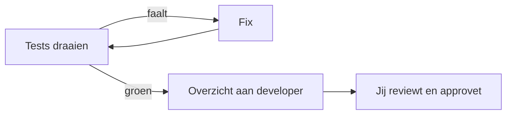

# Fase 3 — Implementatie

Kopieer onderstaande prompt in Cline's chat. De agent implementeert nu precies genoeg om de tests groen te maken.

---

## Prompt (NL)

```
Gebruik specs/specification.md en de tests in tests/test_grade_analyzer.py.

Implementeer exact wat nodig is om alle tests te laten slagen.

Regels:
- Geen extra features
- Geen abstracties voor eenmalige code
- Alleen standaard Python libraries (csv, statistics, argparse)
- Type hints verplicht, docstrings Google-style
- Na elke wijziging: voer harness/run_tests.sh uit
- Bij failing tests: los op, herhaal tot alles groen is
- Schrijf de implementatie in src/grade_analyzer.py
```

---

## Prompt (EN, alternatief)

```
Implement exactly what is needed to make all tests pass.
No extra features. Standard library only.
Run harness/run_tests.sh after every change and fix failures
until everything is green. Write the implementation in src/grade_analyzer.py.
```

---

## Na deze fase

- `bash harness/run_tests.sh` geeft exit code 0
- `python src/grade_analyzer.py data/results.csv` geeft exact de verwachte output uit de opdracht
- De agent heeft geen features toegevoegd die niemand vroeg (check de diff!)

---

## De agent-loop

