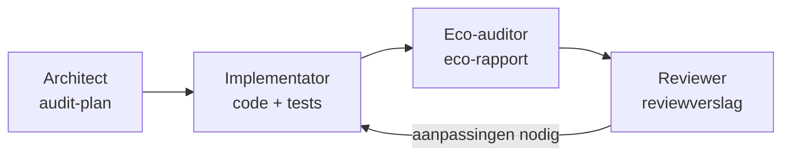

# Praktijkles 3 — Multi-agent workflow: de Green Code Audit (2u)

## Overzicht

In deze les werk je met een **multi-agent setup**: in plaats van één Cline-sessie die alles doet, verdeel je het werk over **vier agent-rollen**, elk in een eigen sessie met een eigen prompt. De handoff tussen de rollen verloopt via documentatie: specs, ADR's, een eco-rapport en een reviewverslag.

De opdracht is de **Green Code Audit**: de Student Grade Analyzer uit praktijkles2 is geleverd door een "ander team". Jij bent het nieuwe team dat hem auditeert, verbetert en rapporteert. Daarbij meet je ook het **ecologische kost** van je eigen AI-workflow.

## Leerdoelen

Na deze les kan de student:

- agent-rollen definiëren en vastleggen in prompts
- een handoff-protocol tussen agents opzetten via documentatie
- het verschil tonen tussen één agent die alles doet en gespecialiseerde rollen
- het tokenverbruik en de kosten van een AI-workflow meten en interpreteren
- een schatting van de ecologische kost maken, met expliciete aannames

## Voorbereiding (5 min)

1. Kopieer je werkende praktijkles2-project naar `praktijkles3/` (of gebruik de meegeleverde structuur). Je hebt nodig: `src/grade_analyzer.py`, `tests/`, `specs/`, `harness/run_tests.sh` en `data/`.
2. Controleer dat `bash harness/run_tests.sh` exit code 0 geeft vóór je begint. Dit is je startpunt: alles moet groen zijn vóór de audit.
3. Maak een eerste commit via de Git MCP-server of `git commit`. Je wilt achteraf kunnen tonen wat elke rol veranderde.

---

## De rollen

| Rol | Taak | Deliverable |
|---|---|---|
| 1. Architect | audit de bestaande spec en code, plan verbeteringen | `docs/ADR/002-audit-plan.md` |
| 2. Implementator | voert de verbeteringen door volgens spec → tests → code | bijgewerkte code, tests groen |
| 3. Eco-auditor | meet en analyseert de ecologische kost van de AI-workflow | `docs/eco_report.md` |
| 4. Reviewer | code review van alle wijzigingen | `docs/review.md` |

Belangrijke principes:

- **Één rol per sessie.** Start na elke rol een nieuwe Cline-sessie. Fris context window, geen rolvermenging.
- **De handoff verloopt via bestanden.** De implementator leest het audit-plan, de reviewer leest de git-diff. Geen agent mag "zomaar beginnen".
- **Jij beslist.** Elke rol stelt voor, jij approved. Bekijk elke diff.
- De prompts staan in `prompts/`: `rol1_architect.md`, `rol2_implementator.md`, `rol3_eco_auditor.md`, `rol4_reviewer.md`.



---

## Deel 1 — De audit door de Architect (25 min)

Start een nieuwe sessie en gebruik `prompts/rol1_architect.md`.

De Architect leest `specs/specification.md`, `src/grade_analyzer.py` en `tests/`, zoekt hiaten in de spec en in de testdekkingsgraad en schrijft een **verbeterplan** met genummerde, toetsbare punten.

**Resultaat:** `docs/ADR/002-audit-plan.md`

Review het plan met deze checklist:

- [ ] elk planpunt is toetsbaar (je kan er een test bij schrijven)
- [ ] er staan geen features in die niemand vroeg
- [ ] de volgorde is realistisch voor een les van 2 uur (max 5 punten)
- [ ] geen enkel planpunt tegen de bestaande tests ingaat

## Deel 2 — De implementatie (40 min)

Start een nieuwe sessie en gebruik `prompts/rol2_implementator.md`.

De Implementator voert het audit-plan uit en mag niets doen dat er niet in staat. Elk planpunt doorloopt spec → tests → code → harness.

**Controle nadien:**

- [ ] `bash harness/run_tests.sh` geeft exit code 0
- [ ] alle audit-planpunten zijn uitgevoerd, geen extra wijzigingen (check de git-diff)

## Deel 3 — De eco-audit (25 min)

Start een nieuwe sessie en gebruik `prompts/rol3_eco_auditor.md`.

De Eco-auditor analyseert de **ecologische kost van je eigen workflow** op drie niveaus. Minimaal niveau 1 is verplicht.

### Niveau 1: meten (verplicht)

Log per agent-sessie uit Deel 1 en 2 het tokenverbruik en de kosten. Cline toont deze in het sessie-overzicht. Vul `docs/eco_log.md` aan (template staat in `prompts/rol3_eco_auditor.md`).

| Sessie | Rol | Model | Tokens in | Tokens uit | Kosten (euro) |
|---|---|---|---|---|---|
| 1 | Architect | gemini-2.5-flash | ... | ... | ... |
| 2 | Implementator | ... | ... | ... | ... |

Extra meting: herhaal **één opdracht** twee keer, eerst met een kale prompt ("verbeter de code"), dan met de context-rijke prompt uit `prompts/rol2_implementator.md`. Noteer het verschil in tokens. Dit meet de stelling "goede context engineering bespaart tokens".

### Niveau 2: schatten naar CO2 (aanbevolen)

Reken de tokens om naar een CO2-schatting met publieke orde-van-grootte-cijfers en benoem elke aanname expliciet (regel uit `karpathy.md`: benoem je aannames). De agent moet dit als **schatting met onzekerheid** presenteren, nooit als exact antwoord.

### Niveau 3: modelvergelijking (optioneel)

Voer dezelfde implementatietaak één keer uit met een kleiner model (bv. Flash) en één keer met een groter model (bv. Pro). Vergelijk tokens, kosten, aantal retries en tijd in een tabel. Let op de gratis OpenRouter-laag: 50 requests per dag, kies je taken dus beperkt.

**Resultaat:** `docs/eco_report.md` met metingen, schatting, aannames en conclusies.

## Deel 4 — De review (20 min)

Start een nieuwe sessie en gebruik `prompts/rol4_reviewer.md`.

De Reviewer bekijkt de volledige git-diff sinds je startcommit, controleert de code tegen de conventies (type hints, docstrings, eenvoud, chirurgische wijzigingen) en keurt goed of vraagt aanpassingen. Aanpassingen gaan terug naar de Implementator in een nieuwe sessie.

**Resultaat:** `docs/review.md`

## Eindreflectie (10 min)

1. Wat ging er mis in de handoff tussen rollen? Welk bestand was het duidelijkst?
2. Bespaarde de context-rijke prompt echt tokens? Hoeveel?
3. Wat is de betrouwbaarheid van je CO2-schatting? Wat zou je nodig hebben voor een betere?
4. Welke rol leverde de meeste meerwaarde, en welke kon je net zo goed overslaan?
5. Wanneer is een multi-agent setup het niet waard? Wanneer wel?

## Checklist

- [ ] praktijkles2-codebasis gekopieerd, tests groen bij start, startcommit gemaakt
- [ ] vier sessies uitgevoerd, één rol per sessie
- [ ] `docs/ADR/002-audit-plan.md` gereviewd vóór Deel 2
- [ ] `bash harness/run_tests.sh` geeft exit code 0 na de implementatie
- [ ] `docs/eco_log.md` ingevuld met minstens twee metingen
- [ ] Niveau 1 van de eco-audit voltooid, aannames expliciet benoemd
- [ ] `docs/review.md` aanwezig met go/no-go per wijziging
- [ ] Eindcommit gemaakt en de diff tonbaar in je verslag

## Problemen?

| Probleem | Oplossing |
|---|---|
| Agent doet werk van een andere rol | Herinner aan de rol-prompt, start een nieuwe sessie |
| Implementator wijzigt meer dan het plan | Reject de diff, verwijs naar `docs/ADR/002-audit-plan.md` |
| Eco-auditor geeft "exacte" CO2-cijfers | Rode vlag: het zijn schattingen. Vraag de aannames expliciet op |
| Reviewer herschrijft code zelf | Reviewer mag alleen rapporteren, niet wijzigen. Nieuwe sessie |
| Tokenverbruik niet zichtbaar | Check het Cline-sessie-overzicht; noteer na elke rol meteen in `eco_log.md` |
| Gratis tier rate limit bereikt | Wacht of wissel model; sla niveau 3 van de eco-audit over |

## Structuur

```
praktijkles3/
├── instructies.md              ← dit bestand
├── .clinerules                 ← agentregels aangevuld met rolregels
├── prompts/
│   ├── rol1_architect.md
│   ├── rol2_implementator.md
│   ├── rol3_eco_auditor.md
│   └── rol4_reviewer.md
├── docs/
│   ├── ADR/002-audit-plan.md   ← ontstaat in Deel 1
│   ├── eco_log.md              ← ontstaat in Deel 3
│   ├── eco_report.md           ← ontstaat in Deel 3
│   └── review.md               ← ontstaat in Deel 4
├── specs/                      ← gekopieerd uit praktijkles2
├── src/                        ← gekopieerd uit praktijkles2
├── tests/                      ← gekopieerd uit praktijkles2
├── harness/                    ← gekopieerd uit praktijkles2
└── data/                       ← gekopieerd uit praktijkles2
```

## Bronnen

- 📘 `voorbereiding/WORKFLOW_VSCODE_CLINE.md` fase 4 (multi-agent patronen, handoff-protocol)
- 📗 `praktijkles1/karpathy.md` (gedragsrichtlijnen, o.a. over aannames en schattingen)
- 🌍 [Codecarbon](https://codecarbon.io/) en [Green Software Foundation](https://greensoftware.foundation/) voor achtergrond over software-ecologie
- 🔌 [Cline (VS Code extensie)](https://marketplace.visualstudio.com/items?itemName=saoudrizwan.claude-dev)