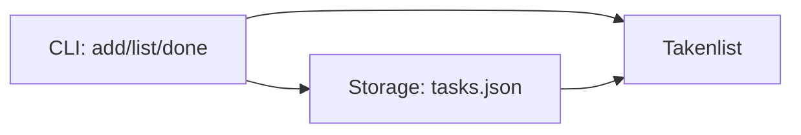

# Architectuur: Taakbeheer-CLI

## Overzicht

Een CLI-applicatie in één Python-module die taken bewaart in een JSON-bestand.
De applicatie heeft drie losse verantwoordelijkheden, elk in een eigen functie of klasse:

1. invoer verwerken van de commandoregel (`add`, `list`, `done`)
2. taken laden en opslaan in `tasks.json`
3. taken tonen en bijwerken (status van `open` naar `klaar`)



## Datastructuur

`tasks.json` is een JSON-lijst van taakobjecten:

```json
[
  { "id": 1, "description": "boodschappen doen", "done": false }
]
```

## Architectuurbeslissingen

| Beslissing | Keuze | Waarom |
|---|---|---|
| Frameworks | geen, alleen de standaardbibliotheek | de opdracht is klein, extra dependencies voegen alleen complexiteit toe |
| Opslag | JSON-bestand in de huidige werkmap | eenvoudig te lezen en te testen, geen database nodig |
| Alternatief | in-memory opslag | afgewezen, taken moeten bewaard blijven tussen sessies |
| Testaanpak | CLI draaien via subprocess in een tijdelijke werkmap | test het echte gedrag, niet alleen interne functies |

## Open vragen

- Blijft het bij drie commando's of komen er later commando's bij, bijvoorbeeld `remove`?
- Moet de output in het Nederlands of in het Engels?

Neem deze vragen op met de opdrachtgever voordat de agent begint.